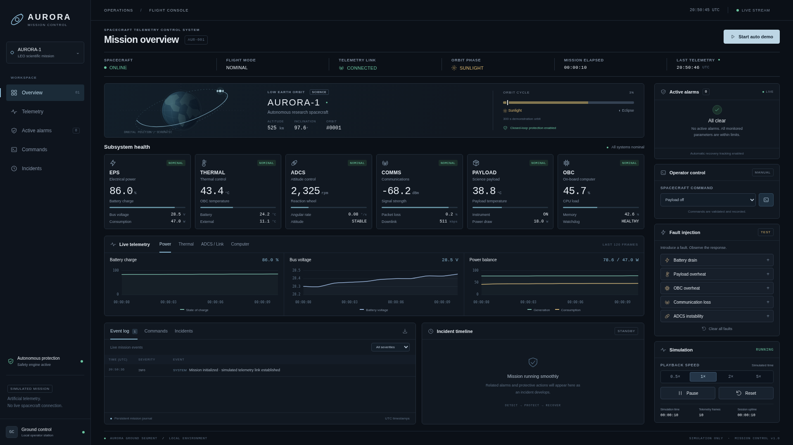
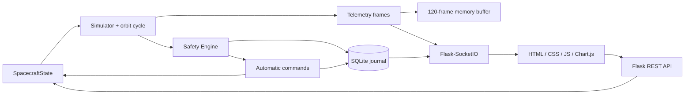

# AURORA · Mission Control

Полностью работающий демонстрационный центр управления небольшим научным спутником **AURORA-1**. Приложение непрерывно рассчитывает связанную телеметрию, обнаруживает отклонения, выполняет защитные команды и показывает восстановление аппарата в браузере.

**Вся телеметрия искусственная. Реального подключения к космическому аппарату нет.** Значения орбиты, пороги и динамика предназначены для наглядной демонстрации; это не ПО для управления полётом.



## Быстрый запуск

Нужен **Python 3.10+**; проверено на Python 3.13. Команды выполняются из корня проекта, где находятся `app.py` и `requirements.txt`.

```bash
python -m venv .venv
```

Linux / macOS:

```bash
source .venv/bin/activate
```

Windows, Command Prompt:

```bat
.venv\Scripts\activate
```

Windows, PowerShell:

```powershell
.venv\Scripts\Activate.ps1
```

Затем:

```bash
pip install -r requirements.txt
python app.py
```

Открыть **http://127.0.0.1:5000**. Остановить сервер: `Ctrl+C`.

На системах, где команда Python называется `python3`, используйте её вместо `python`. SQLite создаётся автоматически в `instance/mission.db`. Для работы интерфейса после установки зависимостей интернет не требуется: Chart.js и Socket.IO включены в `static/vendor/` вместе с лицензиями. Node.js и сборка frontend не нужны.

По умолчанию сервер слушает только `127.0.0.1`, порт **5000**. Если он занят:

```bash
PORT=5050 python app.py
```

В PowerShell: `$env:PORT="5050"; python app.py`. Адрес изменится на `http://127.0.0.1:5050`.

## Что реализовано

- Шесть подсистем: **EPS, THERMAL, ADCS, COMMS, PAYLOAD, OBC**.
- Один общий симулятор и единое состояние для всех открытых вкладок.
- Новый внешний telemetry frame примерно раз в секунду; графики содержат последние 120 кадров.
- Солнечная и теневая части ускоренной орбиты, плавные энергетические и температурные изменения.
- Отдельный Safety Engine: `NORMAL → WARNING → CRITICAL`, гистерезис, защита от повторных команд.
- Пять постепенно развивающихся неисправностей и действующая автоматическая защита.
- Ручные команды с подтверждением и проверкой разрешающих условий на backend.
- Active alarms, долговременные журналы событий и команд, связанный таймлайн инцидентов.
- Автоматическая демонстрация всех пяти сценариев.
- Пауза, продолжение, скорости **0.5× / 1× / 2× / 5×**, сброс симуляции.
- Переподключение Socket.IO с восстановлением истории и текущего состояния.
- Четыре группы графиков: **Power, Thermal, ADCS / Link, Computer**.
- Desktop dashboard на 1920×1080 и адаптивная вёрстка; экспорт загруженного журнала в JSON.

## Как показать проект

### Короткая демонстрация вручную

1. Откройте dashboard: `NOMINAL`, payload `ON`, батарея около 84%, тревог нет.
2. Нажмите **Payload overheat** в Fault Injection. Группа графиков автоматически сменится на Thermal.
3. Температура начнёт расти, примерно через 20 симулированных секунд появится WARNING.
4. Около 29-й секунды температура достигнет CRITICAL; защита выполнит `PAYLOAD_OFF`.
5. Мощность payload станет нулевой. Температура постепенно снизится, alarm очистится, incident перейдёт в RESOLVED.
6. Во вкладке **Commands** видно источник `AUTO` и причину команды; в Incident timeline — всю цепочку событий.
7. Для нового запуска инструмента выберите **Payload on** в Operator control и подтвердите команду после восстановления.

На скорости **2×** сценарий занимает около 20 реальных секунд. На скорости **5×** защитные переходы могут произойти между соседними отображаемыми кадрами; их точные значения и симулированное время остаются в журнале.

### AUTO DEMO

**Start auto demo** включает последовательность:

```text
15 s штатной работы
→ Payload overheat → защита → восстановление
→ 20 s наблюдения
→ Communication loss → восстановление
→ ADCS instability → восстановление
→ OBC overheat → SAFE_MODE → восстановление
→ Battery drain → POWER_SAVE → восстановление
→ повтор цикла
```

Все интервалы измеряются в **симулированном времени**. Следующий сценарий начинается только после исчезновения неисправностей, закрытия тревог и возврата в NOMINAL. После восстановления demo автоматически возобновляет payload, если это разрешено защитой.

Повторное нажатие останавливает запуск новых сценариев. Уже введённая неисправность продолжит развиваться до защитного действия, восстановления или **Clear all faults**. Пауза останавливает также время auto demo. Ручной SAFE_MODE удерживается до команды оператора; такой режим намеренно приостанавливает дальнейшее auto demo.

## Математическая модель

`SpacecraftState` содержит физическое состояние; `Simulator` интегрирует его шагами не более 0.5 секунды. Температуры, нагрузка, качество связи и обороты стремятся к связанным целевым значениям по экспоненциальной модели первого порядка:

```text
next = target + (current − target) × exp(−rate × dt)
```

Энергия рассчитывается из разности солнечной генерации и потребления:

```text
consumption = base_load + payload_power + cpu_load × coefficient
              + secondary_processes + injected_parasitic_load

Δcharge_percent = (generation − consumption) / (4.5 Wh × 3600) × 100 × dt
```

Эквивалентная батарея 4.5 Wh ускоряет изменения для демонстрации. В солнце генерация около 78 W; включённый payload потребляет 18 W. Нагрузка CPU повышает его температуру и общее потребление; после отключения payload его температура падает постепенно. Буфер данных заполняется при работе payload и разгружается при достаточном качестве связи. Отказ связи повышает packet loss, ослабляет сигнал и уменьшает downlink. ADCS instability постепенно повышает угловую скорость и RPM.

Шум измерения мал по сравнению с динамикой и гистерезисом. Начальное случайное зерно фиксировано, поэтому проверки воспроизводимы.

Демонстрационная орбита длится **300 s**: 65% SUNLIGHT, 35% ECLIPSE. Значения 525 km и 97.6° в интерфейсе — заданные характеристики миссии; орбитальная схема не рассчитывает реальные эфемериды. Ускоренный цикл не соответствует физическому периоду орбиты на этой высоте.

## Safety Engine

Пределы находятся в [`spacecraft_control/config.py`](spacecraft_control/config.py), словарь `LIMITS`. Для каждой метрики заданы подсистема, название, WARNING, CRITICAL, гистерезис, направление и единица.

| Параметр | WARNING | CRITICAL | Гистерезис |
|---|---:|---:|---:|
| Battery charge | ≤30% | ≤15% | 4 процентных пункта |
| Battery voltage | ≤24 V | ≤22.5 V | 0.4 V |
| Battery temperature | ≥45°C | ≥55°C | 3°C |
| OBC temperature | ≥70°C | ≥80°C | 4°C |
| Payload temperature | ≥70°C | ≥85°C | 5°C |
| Reaction wheel | ≥5,500 rpm | ≥7,200 rpm | 400 rpm |
| Angular velocity | ≥1.5°/s | ≥3.5°/s | 0.3°/s |
| Packet loss | ≥5% | ≥20% | 2 процентных пункта |
| Signal strength | ≤−95 dBm | ≤−110 dBm | 4 dBm |
| CPU load | ≥80% | ≥95% | 5 процентных пунктов |
| Memory usage | ≥85% | ≥95% | 4 процентных пункта |
| Data buffer | ≥80% | ≥95% | 5 процентных пунктов |

Например, после превышения OBC 80°C состояние остаётся CRITICAL вплоть до снижения до 76°C; WARNING очистится при 66°C. Значения 79.9/80.1 не создают повторяющиеся тревоги.

Safety Engine проверяет состояние **не реже одного раза за симулированную секунду**, независимо от выбранной скорости воспроизведения. SQLite event создаётся только при смене состояния, а не на каждом кадре. Активный alarm обновляет текущее измерение в памяти. Повторное срабатывание защиты по тому же параметру разрешается после полного возврата в NORMAL. Дополнительная проверка аварийного нагрева OBC действует и без нового перехода WARNING/CRITICAL.

### Автоматические действия

| Условие | Действия и реальное влияние на модель |
|---|---|
| Критически низкий заряд или напряжение | `PAYLOAD_OFF`, `ENTER_POWER_SAVE`; устранение паразитной нагрузки, снижение CPU и потребления. После восстановления — `RETURN_NOMINAL`. |
| Перегрев payload | `PAYLOAD_OFF`; прекращение дефектного нагрева, мощность 0 W, постепенное охлаждение. Сам payload остаётся OFF до команды оператора или auto demo. |
| Перегрев OBC | `CPU_THROTTLE`; остановка второстепенных процессов и снижение CPU. При дальнейшем нагреве до 90°C — `ENTER_SAFE_MODE`, устранение источника перегрева. |
| Критическое ухудшение связи | `COMMS_REACQUIRE`; состояние REACQUIRING на 8 симулированных секунд, затем плавное восстановление сигнала. Результат записывается как RECOVERY. |
| Критическая нестабильность ADCS | `ADCS_DESATURATION`; плавное снижение RPM и угловой скорости. При RPM ≥9,000 или угловой скорости ≥5.5°/s — SAFE_MODE. |
| Перегрев батареи | Payload off и SAFE_MODE. |
| Перегрузка CPU / памяти | CPU_THROTTLE. |
| Переполнение science buffer | PAYLOAD_OFF. |

Автоматический POWER_SAVE никогда не понижает существующий SAFE_MODE. Нельзя включить payload при небезопасных параметрах или вернуться в NOMINAL при активной неисправности. Отказанная команда сохраняется с `result: REJECTED` и возвращает HTTP 409. Режим, выбранный оператором, не снимается автоматически.

## Fault Injection

| Идентификатор API | Поведение |
|---|---|
| `BATTERY_DRAIN` | Постепенно растущая паразитная нагрузка разряжает батарею. Начинать из NOMINAL. |
| `PAYLOAD_OVERHEAT` | Постепенно усиливающийся дополнительный нагрев. Требуется payload ON. |
| `OBC_OVERHEAT` | Развитие перегрева CPU с остаточным нагревом после throttling. Недоступен при уже активном SAFE_MODE. |
| `COMMUNICATION_LOSS` | Постепенная деградация packet loss, сигнала и downlink. |
| `ADCS_INSTABILITY` | Рост RPM и угловой скорости. |

Ввод не меняет мгновенно температуру, заряд или обороты. Повторный ввод уже активной неисправности возвращает понятную ошибку. Несколько разных неисправностей можно сочетать.

**Clear all faults** убирает источники неисправностей, сохраняя текущее физическое состояние: температура и заряд восстанавливаются постепенно, а alarms очищаются по правилам. **Reset simulation** создаёт новый `run_id`, восстанавливает начальные условия, обнуляет время и telemetry frames, очищает оперативную историю, возвращает скорость 1× и выключает auto demo. Старые события и команды остаются в SQLite; открытые incidents закрываются со статусом RESET.

## Архитектура и структура



```text
app.py                          # запуск локального сервера и worker
requirements.txt                # runtime-зависимости
requirements-dev.txt            # pytest и Playwright
pytest.ini
spacecraft_control/
  __init__.py                   # application factory, Socket.IO connection
  config.py                     # настройки, LIMITS, FAULTS
  telemetry/
    models.py                   # dataclass SpacecraftState
    simulator.py                # интеграция физической модели
    generator.py                # телеметрический кадр и шум измерения
  safety/
    rules.py                    # гистерезис и оценка уровня
    engine.py                   # состояния alarms, incidents, recovery
    actions.py                  # соответствие параметров и защитных команд
  services/
    telemetry_service.py        # общий mission controller, worker, demo
    event_service.py            # SQLAlchemy, SQLite, journal и alarms
  routes/
    api.py                      # JSON REST API и валидация
    views.py                    # dashboard
  templates/
    base.html
    dashboard.html
  static/
    css/style.css
    js/dashboard.js
    vendor/                     # Chart.js, Socket.IO, MIT licenses
tests/
  conftest.py
  test_mission.py                # аварийные сценарии, динамика, persistence
  test_api.py                    # API, ошибки, Socket.IO, reconnect
  browser_smoke.py               # ручной запуск браузерной проверки
docs/                           # скриншоты работающего приложения
instance/mission.db             # генерируется при запуске, не входит в git
```

В проекте используется стандартный `threading.Thread` и `RLock`: HTTP-команды, сброс, socket snapshot и шаг модели сериализованы. Повторный `start()` не создаёт второй worker. SQLAlchemy открывает короткие сессии для операций с БД, SQLite использует WAL и busy timeout. Отключение браузера не останавливает модель; ошибки отправки socket логируются. При исключении в шаге симулятор ставится на паузу, а сервер и управление остаются доступны.

Приложение рассчитано на **один локальный процесс**. Не запускайте несколько worker с общей БД: у каждого была бы отдельная физическая модель. При старте нового процесса старые незавершённые incidents становятся INTERRUPTED, старые активные alarms закрываются. Это не означает физическое восстановление прошлой миссии: начинается новый запуск.

Память графиков ограничена 120 кадрами; браузер удерживает до 200 загруженных событий/команд. Постоянный журнал не удаляется автоматически и со временем растёт. Перезапуск сохраняет journal, но не продолжает старое физическое состояние и ring buffer.

## REST API

Все тела POST — JSON; время хранится в ISO 8601 UTC. Общая телеметрия и параметры всех подсистем находятся в одном плоском telemetry frame, вместе с `subsystem_status` и `run_id`.

| Метод | Путь | Результат |
|---|---|---|
| GET | `/api/telemetry/current` | Последний кадр |
| GET | `/api/telemetry/history` | До 120 последних кадров текущего run |
| GET | `/api/events` | События, новые первыми |
| GET | `/api/alarms` | Только активные alarms |
| GET | `/api/alarms?history=true` | Постоянная история alarms |
| GET | `/api/commands` | Журнал команд, новые первыми |
| GET | `/api/status` | Mode, simulation, speed, uptime, frames, faults, auto demo |
| GET | `/api/incidents` | Последние 30 incidents |
| GET | `/api/incidents/<id>` | До 500 связанных событий по возрастанию времени |
| GET | `/api/snapshot` | Текущее состояние, история, alarms, events, commands, incidents |
| POST | `/api/command` | Выполнить команду |
| POST | `/api/fault/inject` | Ввести неисправность |
| POST | `/api/fault/reset` | Удалить источники неисправностей |
| POST | `/api/simulation` | Pause / resume / reset / speed / demo |

`/api/events` и `/api/commands` поддерживают `?limit=100&before=123` для просмотра старых записей. Допустимый limit: 1–500. `before` — идентификатор последней записи предыдущей страницы. History alarms поддерживает `limit`.

Примеры:

```bash
curl http://127.0.0.1:5000/api/status

curl -X POST http://127.0.0.1:5000/api/fault/inject \
  -H 'Content-Type: application/json' \
  -d '{"fault":"PAYLOAD_OVERHEAT"}'

curl -X POST http://127.0.0.1:5000/api/command \
  -H 'Content-Type: application/json' \
  -d '{"command":"PAYLOAD_OFF"}'

curl -X POST http://127.0.0.1:5000/api/simulation \
  -H 'Content-Type: application/json' \
  -d '{"action":"speed","value":2}'

curl -X POST http://127.0.0.1:5000/api/simulation \
  -H 'Content-Type: application/json' \
  -d '{"action":"demo","value":true}'
```

Допустимые команды оператора: `PAYLOAD_ON`, `PAYLOAD_OFF`, `ENTER_POWER_SAVE`, `ENTER_SAFE_MODE`, `RETURN_NOMINAL`, `COMMS_REACQUIRE`, `ADCS_DESATURATION`. `CPU_THROTTLE` используется только автономной защитой.

Управление симуляцией:

```json
{"action":"pause"}
{"action":"resume"}
{"action":"reset"}
{"action":"speed","value":0.5}
{"action":"demo","value":false}
```

Некорректный JSON, неизвестная команда/неисправность и недопустимое значение дают **400**, небезопасная команда — **409**, тело больше 4 KB — **413**. Ошибки содержат `error` либо `detail` с объяснением.

Event содержит `timestamp`, `simulation_time`, `severity`, `subsystem`, `message`, `parameter`, `measured_value`, `threshold`, `automatic_action`, `incident_id`, `run_id`. Command содержит `timestamp`, `simulation_time`, `source`, `command`, `subsystem`, `reason`, `result`, `detail`, `incident_id`, `run_id`. `EXECUTED` означает, что команда применена к модели; завершение продолжительной операции отражается следующим событием RECOVERY. Повторная ручная команда, не меняющая состояния, отмечается `NO_CHANGE`.

## WebSocket / Socket.IO

Используется Socket.IO на том же порту, путь `/socket.io/`. Клиент проходит стандартный handshake и переключается на WebSocket; предусмотрен транспортный fallback Socket.IO. Сам dashboard не выполняет ежесекундные REST-запросы.

| Событие сервера | Данные |
|---|---|
| `initial_state` | Полный snapshot при подключении и переподключении |
| `telemetry_update` | Новый telemetry frame |
| `alarm_update` | Текущие активные alarms с измеренными значениями |
| `event_update` | Одно новое событие журнала |
| `command_update` | Одна новая запись command history |
| `spacecraft_status_update` | Состояние аппарата и симуляции |
| `incident_update` | Обновлённый список incidents |
| `simulation_reset` | Полный snapshot нового run |

Симулированная потеря COMMS не отключает связь браузера с сервером: наземный dashboard продолжает показывать развитие аварии. Индикатор **LIVE STREAM** обозначает соединение браузера с Flask, а **TELEMETRY LINK** — модель бортовой связи. При настоящем отключении сервера интерфейс помечает данные как устаревшие и блокирует отправку команд до переподключения.

## Настройки

Переменные окружения:

| Имя | По умолчанию | Назначение |
|---|---|---|
| `HOST` | `127.0.0.1` | Адрес локального сервера |
| `PORT` | `5000` | HTTP и Socket.IO порт |
| `DATABASE_URL` | `sqlite:///.../instance/mission.db` | Путь к SQLite |

`HISTORY_SIZE`, `TICK_INTERVAL`, `ORBIT_PERIOD`, `SUNLIGHT_FRACTION`, `SEED` и `LIMITS` меняются в `config.py`. Application factory `create_app({...})` принимает переопределения для тестов; `SAFETY_LIMITS` позволяет заменить словарь правил. Worker запускается явным `app.extensions['mission'].start()`; `app.py` делает это автоматически. Используйте `python app.py`, а не `flask run`.

## Проверка

```bash
pip install -r requirements-dev.txt
python -m pytest -q
```

Набор из **62 тестов** проверяет каждый fault на всех четырёх скоростях, warning/critical/recovery, влияние защитных действий, гистерезис, отсутствие повторных команд, четыре штатные орбиты, совместные неисправности, auto demo, interlocks, pause/reset, повторные аварии, конкурентные обращения, сохранность SQLite, API и переподключение Socket.IO.

Дополнительная проверка в настоящем Chromium выполняется при запущенном сервере:

```bash
python -m playwright install chromium
python tests/browser_smoke.py
```

Она проверяет WebSocket, рост данных Chart.js, паузу, переключение графиков, подтверждение/отмену команд, развитие перегрева payload и recovery, таймлайн, отключение/восстановление соединения и мобильную ширину. Тест действительно управляет запущенной симуляцией, вводит неисправность и сбрасывает её; journal сохраняется. Скриншоты записываются в `test-results/`. Для другого адреса задайте `TEST_BASE_URL`, для системного Chromium — `CHROMIUM_PATH`.

## Зависимости и справочные материалы

Backend: Flask 3.1.3, Flask-SocketIO 5.6.1, SQLAlchemy 2.0.48, simple-websocket 1.1.0. Frontend: Chart.js 4.4.8, Socket.IO client 4.8.1. Локальный запуск использует потоковый Werkzeug-сервер; он предназначен для этого локального демонстрационного проекта.

- [Flask-SocketIO — initialization, background events and connections](https://flask-socketio.readthedocs.io/en/latest/getting_started.html)
- [SQLAlchemy — session lifecycle](https://docs.sqlalchemy.org/en/20/orm/session_basics.html)
- [Chart.js — documentation](https://www.chartjs.org/docs/latest/)
- [Socket.IO — client documentation](https://socket.io/docs/v4/client-api/)

Лицензии включённых JS-библиотек: [`CHARTJS-LICENSE.md`](spacecraft_control/static/vendor/CHARTJS-LICENSE.md), [`SOCKETIO-LICENSE.txt`](spacecraft_control/static/vendor/SOCKETIO-LICENSE.txt).
